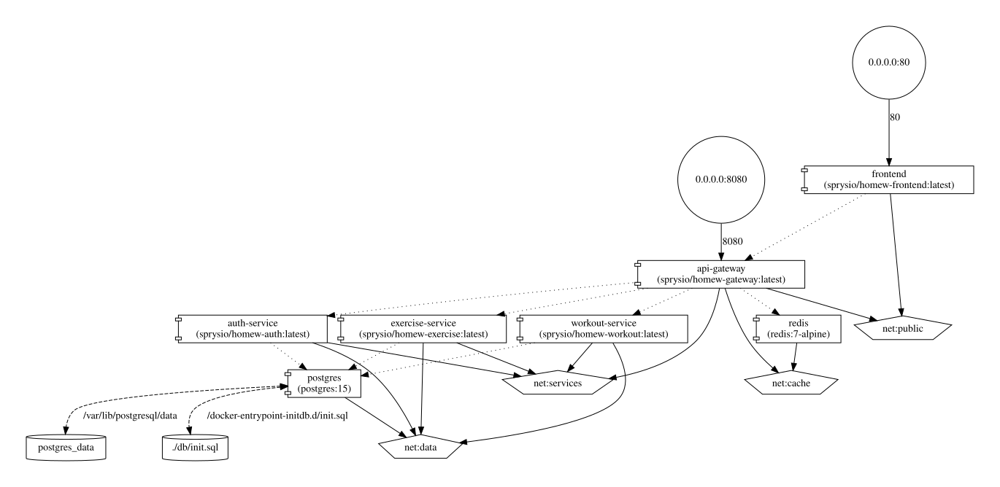

# ZADANIE CZĄSTKOWE nr 1

## 1. Architektura systemu

Diagram architektury został dołączony do sprawozdania w pliku pdf.

## 2. Dockerfile dla mikroserwisów

Każdy serwis posiada własny plik Dockerfile:
- [api-gateway/Dockerfile](api-gateway/Dockerfile)
- [auth-service/Dockerfile](auth-service/Dockerfile)
- [exercise-service/Dockerfile](exercise-service/Dockerfile)
- [workout-service/Dockerfile](workout-service/Dockerfile)
- [frontend/Dockerfile](frontend/Dockerfile)

Zastosowane rozwiązania zgodne z dobrymi praktykami budowania obrazów Docker:
- **Multi-stage build** - oddziela środowisko budowania od obrazu produkcyjnego, znacznie redukując jego rozmiar i powierzchnię ataku,
- **Lekkie obrazy bazowe** (np. `alpine`, `distroless`) - minimalizują liczbę preinstalowanych pakietów, co ogranicza potencjalne podatności,
- **Nieuprzywilejowany użytkownik** - aplikacja nie jest uruchamiana jako `root`, co ogranicza skutki ewentualnego przejęcia kontenera,
- **`.dockerignore`** - wyklucza zbędne pliki (np. `.git`, `node_modules`, pliki testowe) z kontekstu budowania, skracając czas budowy i zmniejszając obraz,
- **Uporządkowane kopiowanie zależności przed kodem źródłowym** - umożliwia efektywne korzystanie z cache warstw Dockera; zależności są reinstalowane tylko przy zmianie pliku z zależnościami (np. `package.json`),
- **Etykiety `LABEL`** - opisują obraz metadanymi (autor, wersja, repozytorium), co ułatwia zarządzanie obrazami.

## 3. Obrazy DockerHub i multi-arch

Obrazy są budowane automatycznie w GitHub Actions i publikowane do DockerHub dla dwóch architektur:
- `linux/amd64`
- `linux/arm64`

W workflow włączono również generowanie SBOM oraz provenance.

Plik workflow:
- [.github/workflows/build.yaml](.github/workflows/build.yaml)

Repozytoria DockerHub:
- https://hub.docker.com/repository/docker/sprysio/homew-auth/general
- https://hub.docker.com/repository/docker/sprysio/homew-workout/general
- https://hub.docker.com/repository/docker/sprysio/homew-exercise/general
- https://hub.docker.com/repository/docker/sprysio/homew-gateway/general
- https://hub.docker.com/repository/docker/sprysio/homew-frontend/general

## 4. Analiza podatności Trivy

Skanowanie podatności realizowane jest w GitHub Actions za pomocą Trivy. Wyniki są:
- zapisywane jako artefakty,
- publikowane w zakładce Security w sekcji Code scanning.

Workflow skanuje obrazy po zbudowaniu i nie dopuszcza podatności o poziomie `critical` ani `high`. Przeprowadzone skanowanie nie wykazało żadnych podatności na poziomie `critical` ani `high` - wszystkie obrazy przeszły weryfikację pomyślnie.

Wyniki skanowania: https://github.com/Sprysio/Home-Workout-Projekt/security/code-scanning

Plik workflow:
- [.github/workflows/build.yaml](.github/workflows/build.yaml)

## 5. docker-compose dla wersji testowej

Plik [docker-compose.yml](docker-compose.yml) zawiera testową wersję uruchomieniową aplikacji z:
- frontendem,
- API Gateway,
- usługami domenowymi,
- PostgreSQL,
- Redis,
- sieciami `public`, `services`, `data`, `cache`,
- woluminem `postgres_data`,
- healthcheckami,
- zmiennymi środowiskowymi,
- limitami zasobów.

## 6. Wizualizacja docker-compose używając compose-viz

Wygenerowana wizualizacja Compose:

Plik źródłowy: [compose-viz.svg](compose-viz.svg)

## 7. Uwagi końcowe
Ostatnie uruchomienie workflow GitHub Actions, zawierające build, push oraz wyniki skanowania Trivy dla wszystkich obrazów:
- https://github.com/Sprysio/Home-Workout-Projekt/actions/runs/24259376118